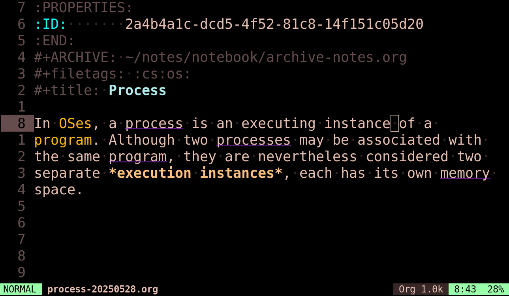
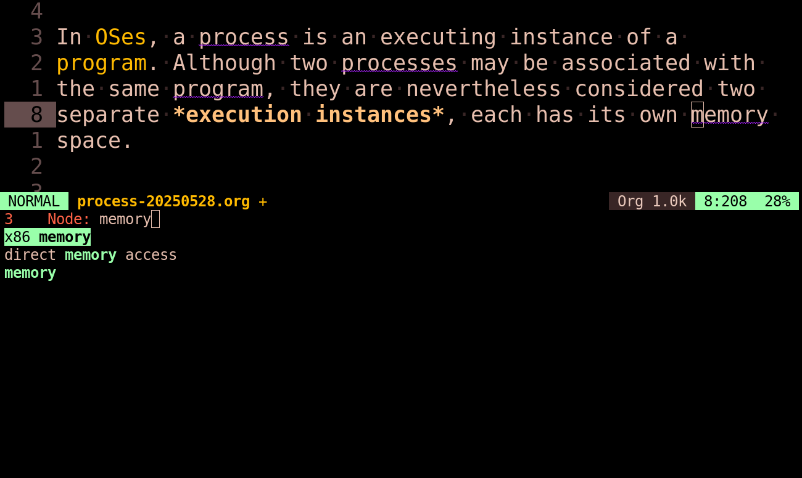

# ☕ Org-roam Latte

**Org-roam Latte** is a minor mode that automatically highlights **unlinked org-roam references** in your buffer. It scans your current text and identifies words or phrases that match existing org-roam nodes (titles and aliases). It brings the "Unlinked Mentions" feature found in tools like Obsidian or Roam Research directly into Emacs, helping you discover connections you might have missed.

## Features

* **Fast:** Uses an optimized inverted search strategy. It scans _only_ the visible section of a buffer, and checks against a hash table. It stays snappy even with thousands of nodes.
* **Smart Linking:** Highlighted words are nivgatable.
    * **Click / RET**: Visit the node.
    * **M-RET**: Instantly convert the text into a formal org-roam ID link.
* **Pluralization:** Automatically handles pluralization (e.g., a node titled "Algorithm" will highlight "algorithms" in your text).
* **Org-roam Alias Support:** Recognizes and highlights your node aliases as well.
* **Context Aware:**
    * Ignores existing Org links.
    * Intelligent handling of code blocks (only highlights inside comments).
    * Adapts colors automatically for Light and Dark themes.

## Great Performance

Many "auto-linker" packages suffer from performance issues because they search the buffer for every single node in your database ($N \times M$ complexity).

**Org-Roam Latte is different.**
1.  On startup (or DB sync), it builds a fast Hash Table of your titles and aliases.
2.  When you scroll, it scans the *visible* text for word boundaries.
3.  It checks those candidate words against the Hash Table ($O(1)$ lookup) 🚀.

This ensures that scrolling remains is smooth, regardless of whether you have 100 notes or 10,000. This also ensures that there is no performance hit even when you open _extermely large files_.

## Installation

### Manual
Clone the repository and add it to your load path. Then, add hooks to enable it automatically for Org files and Programming buffers:

```elisp
(add-to-list 'load-path "/path/to/org-roam-latte")
(require 'org-roam-latte)

;; Enable in Org buffers
(add-hook 'org-mode-hook #'org-roam-latte-mode)
;; Enable in Programming buffers (highlights comments only)
(add-hook 'prog-mode-hook #'org-roam-latte-mode)
```

### Use-package
```elisp
(use-package org-roam-latte
  :straight (:host github :repo "yad-tahir/org-roam-latte")
  :hook ((org-mode . org-roam-latte-mode)
         (prog-mode . org-roam-latte-mode)))
```

## Interactions
When you navigate to a highlighted word (declared in `org-roam-latte-keyword-map`):
* **<Mouse-1> (Left Click)**: Open the node.
* **RET**: Open the node.
* **M-RET** (Alt+Enter): Convert the highlighted text into a link.

# Customization

### Customization Variables
| Variable | Default | Description |
| :--- | :--- | :--- |
| `org-roam-latte-ignore-words` | `'()` | A list of strings to exclude from highlighting. |
| `org-roam-latte-highlight-prog-comments` | `t` | If `t`, Latte will highlight keywords inside comments in programming modes. |

### Theming
The highlighting face is `org-roam-latte-keyword-face`. It defaults to **Purple** (Light Mode) or **Cyan** (Dark Mode) with a wavy underline. You can customize this in your config, e.g.:

```elisp
(custom-set-faces
 '(org-roam-latte-keyword-face ((t (:inherit warning :underline (:style wave))))))
```

# Fancy Screenshots!



